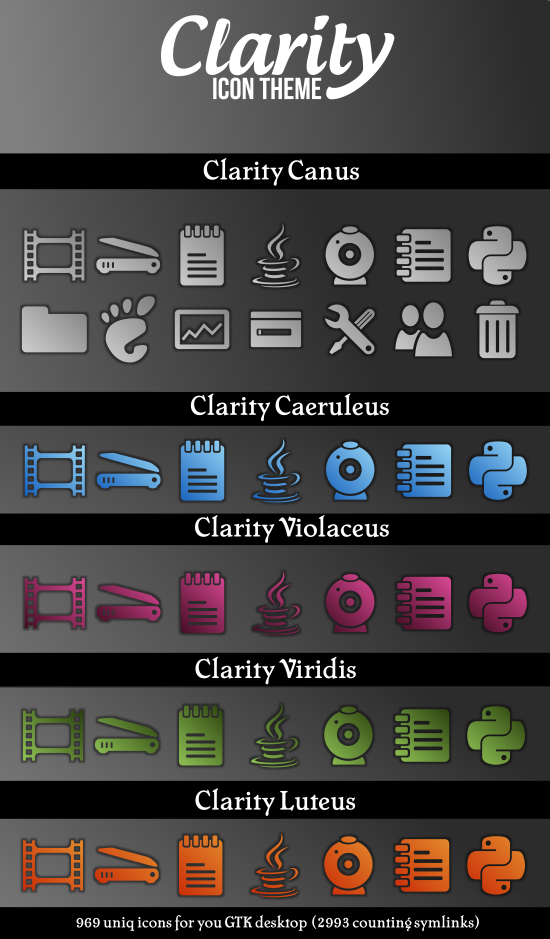

# Clarity Vector Icon theme for GTK



This theme is based on AwOken and Token, lots of shapes and basic color pallete was
taken from these icons. Few icons was taken from Raphael <http://raphaeljs.com/>.
I use some shapes from OpenClipart <http://www.openclipart.org>, Wikipedia, Humanity,
AnyColorYouLike Themes and Emoji One icons. The rest of icons I design myself
by simplifying existed icons or logos. I use mostly two fonts: Impact and Cheboygan.

Icons are mostly monoshape, but some icons have additional elements. There are nine
predefined color themes (in five colors) but you can also crete your own.

Available themes:

| Name           | Description             |
|----------------|-------------------------|
| violaceus      | violet/pink gradient    |
| lux_violaceus  | glossy variant          |
| canus          | grey gradient (default) |
| dark_canus     | dark grey gradient      |
| caeruleus      | blue gradient           |
| lux_caeruleus  | glossy variant          |
| viridis        | green gradient          |
| luteus         | orange gradient         |
| albus          | white solid             |

## INSTALLATION

copy Clarity folder to ~/.icons or /usr/share/icons as root

on Ubuntu based systems you can install Clarity from PPA (execute from terminal
without $)

```bash
$ sudo add-apt-repository ppa:jcubic/jcubicppa && sudo apt-get update

$ sudo apt-get install clarity-icon-theme
```

You can also use GNU/Linux build package mantra

```bash
$ ./configure && make && sudo make install
```

instead of make you can use

```bash
$ make <theme>
```

## CHANGING COLORS OF ICONS

To change color theme of icons:

1. open folder ~/.icons/Clarity
2. double click change-theme
3. select the theme and click ok

If you install this theme from deb or PPA

```bash
gksu change-theme
```

To run the script you must have installed zenity

You can also run from terminal:

```bash
make <name of the theme>
```

## CHANGING DISTRIBUTOR LOGO

```bash
make fedora
```

available logos are:
* debian
* fedora
* gentoo
* gnome
* kubuntu
* madriva
* mint
* suse
* ubuntu
* xfce
* xubuntu 

you must run this command from `~/.icons` folder or `/usr/share/icons/Clarity`
if you install from deb or PPA.

## FURTHER CUSTOMIZATION

Every icon is made from a single shape and a template so it's easy to customize.
You can create custom theme by creating new file `src/template_<your_name>.svg`
see default templates to see how they are build. Basicly all templates must have
`{{PATH}}` and `{{TITLE}}` marks which will be replaced by data from the "source"
of an icon. You can create theme in Inkscape but after saving you must put {{PATH}}
marker in d atrribute of the shape (I don't tested but it sould work). You 
can also edit template by hand see SVG Specification <http://www.w3.org/TR/SVG/>
to see what transformations and effects you can add.

If you done editing your custom template double click `change-theme` and select
`<your_name>` to create your custom icons.

If you want to use make you must run `./configure` first

## OTHER CONTRIBUTORS

* Enneric Valmorin
* Chris Lenk

## BUILDING PACKAGES

On Ubuntu deb packages

```bash
sudo apt-get install devscripts build-essential lintian debhelper librsvg2-bin
# this will create debian pacakge
make deb
# this will install source package for dput
make source-deb
```

You will also need GPG to sign the package

Creating a tarball:

```
make tar.gz
```

The file will have the same name as the directory and located one level up.


## LICENSE

Copyright (c) 2010-2025 [Jakub T. Jankiewicz](https://jcubic.pl/me)<br/>
Licensed under [CC-BY-SA 4.0 license](http://creativecommons.org/licenses/by-sa/4.0/)<br/>
horned skull by Juicy Fish from [Noun Project](https://thenounproject.com/browse/icons/term/horned-skull/) (CC BY 3.0)
