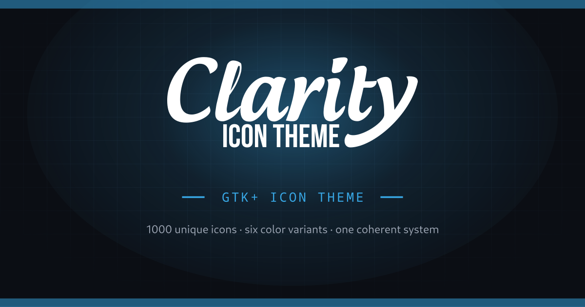

# Clarity — Vector Icon Theme for GTK



Clarity is a clean monoshape icon theme for Linux, that alows you to customize your system just as
you want.

* one command to pick any color you want,
* 1000 unique icons, over 3000 including symlinks,
* 13 builtin styles, with additional provided by cummunity.

**Website:** [clarity.pl.eu.org](https://clarity.pl.eu.org)

**Repo:** [jcubic/Clarity](https://github.com/jcubic/Clarity)

## Quick Install

```bash
curl -sL https://clarity.pl.eu.org/install | bash
```

Then pick a variant and build your icons:

```bash
clarity use caeruleus
```

## Usage

```bash
clarity use <variant>             # switch to a built-in variant
clarity list                      # show available variants and installed themes
clarity install @user/theme       # download a community theme from the gallery
clarity use @user/theme           # activate a community theme
clarity update                    # update CLI, base theme, and community themes
clarity create ./template.svg     # create a local theme from an SVG file
clarity remove @user/theme        # remove a community theme
clarity uninstall                 # remove Clarity completely
```

## Install from Source

```bash
git clone https://github.com/jcubic/Clarity.git
cd Clarity/theme
make install
```

## Install from Packages

Download `.deb` or `.rpm` from the [releases](https://github.com/jcubic/Clarity/releases) page:

```bash
# Debian/Ubuntu
sudo dpkg -i clarity-icons_*.deb

# Fedora/RHEL
sudo rpm -i clarity-icons-*.rpm
```

## Repository Structure

This is a monorepo with two projects:

| Directory | Description | Docs |
|-----------|-------------|------|
| [`theme/`](theme/) | CLI manager, icon sources, templates, build system | [theme/README.md](theme/README.md) |
| [`web/`](web/) | PHP website — gallery, upload wizard, icon API | [web/README.md](web/README.md) |

## Contributing

See [CONTRIBUTING.md](CONTRIBUTING.md) for how to create and submit new icons.

You can also create and share your own theme template — upload it to the
[gallery](https://clarity.pl.eu.org/#gallery) from the website or use the CLI.

## License

Copyright (c) 2010-2026 [Jakub T. Jankiewicz](https://jakub.jankiewicz.org/)

Licensed under [CC-BY-SA 4.0](https://creativecommons.org/licenses/by-sa/4.0/).

horned skull by [Juicy Fish](https://thenounproject.com/creator/admin885/) from [Noun Project](https://thenounproject.com/browse/icons/term/horned-skull/) (CC BY 3.0)
